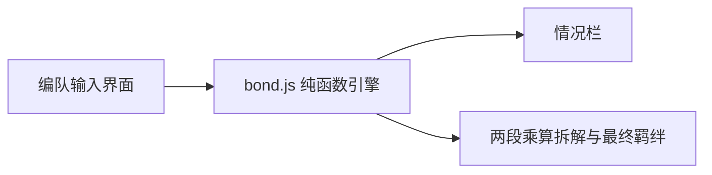

# 通关羁绊计算器

Feature Name: bond-calculator
Updated: 2026-09-08

## Description

浏览器内的单页计算器。玩家填写关卡基础羁绊和最多 6 个位置的加成，系统按权威公式即时算出每名己方从者的最终羁绊与两段乘算拆解。无后端、无存档、刷新清空。

权威公式：

`最终羁绊 = (floor(floor(关卡基础羁绊 × (1 + 前排)) × (1 + Σ第二层百分比)) + Σ固定值) × 茶壶倍率`

前排单独先乘一层并 floor。礼装、午餐/午茶/福尔摩斯、活动被动、15绊在第二层加算后再乘并 floor。茶壶开启时倍率为 2，关闭时为 1。

## Architecture

输入变化即重算。计算引擎与 DOM 分离，便于用 Node 跑手算样例验收。

## Components and Interfaces

### `calcParty(base, teapot, slots)`

输入：非负整数 `base`、布尔 `teapot`、长度 6 的 `slots`。
输出：`{ ok, error, caseText, results[] }`。

每个 result 含：`position`、`eligible`、`reason`、`lines[]`、`frontPct`、`addRate`、`percentSum`、`afterFront`、`afterRate`、`flat`、`beforeTeapot`、`teapotMul`、`final`。

### 位置输入

- `filled`：是否上场
- `isSupport`：是否助战，全队最多 1 个
- `bond15`：是否 15 绊。非助战时计入 N×25%，且本人最终羁绊为 0
- `lunch`：0 / 0.02 / 0.10
- `teaSelf`：己方午茶 0 / 0.01 至 0.05
- `supportTea`：助战午茶 0 / 0.03 / 0.06 / 0.09 / 0.12 / 0.15，加到每名可获得羁绊的己方从者
- `holmes`：0 / 0.01 / 0.05
- `condCe`：0 / 0.04 / 0.20
- `eventPassive`：0 / 0.20 / 0.50，只加自己
- `customPercent`：自定义第二层百分比
- `portrait`：英灵肖像，固定 +50

### 情况栏

- 助战前排：己方每人 +4%
- 其他：前排己方 +20%，后排 0%
- 始终标明空位不参与 15 绊与光环统计

## Data Models

无持久化。页面内存中保存一份 `PartyState`。默认关卡基础羁绊 815，1-3 号位上场且为己方。

## Correctness Properties

- 前排先 `floor(基础 × (1 + 前排))`，再 `floor(该结果 × (1 + 第二层))`
- 英灵肖像加在两段 floor 之后，不吃百分比
- 助战本人与 15 绊本人最终羁绊为 0
- 助战 15 绊不提供 +25%
- 手算样例：815、前排、午餐 10%、午茶 5%、条件礼装 20%、无茶壶 => 1320；开茶壶 => 2640
- 社区 5 人样例：815、每人 20% 礼装 + 肖像 50 => 前排 1419、后排 1191、合计 6639

## Error Handling

- 基础羁绊不是非负整数：拒绝计算，情况栏提示「请输入非负整数」
- 标记第二个助战时：新标记覆盖旧标记，全队只保留 1 个助战

## Test Strategy

`src/bond.test.js` 用 Node assert 覆盖：1320 样例、6639 五人样例、助战 0、15 绊叠层、助战前排平分、肖像不吃百分比、助战午茶光环、非法基础羁绊。

## References

[^1]: (Filename) - 用户迁入的羁绊公式口径 `.monkeycode/MEMORY.md`
[^2]: (Filename) - 需求文档 `.monkeycode/specs/2026-09-08-bond-calculator/requirements.md`
