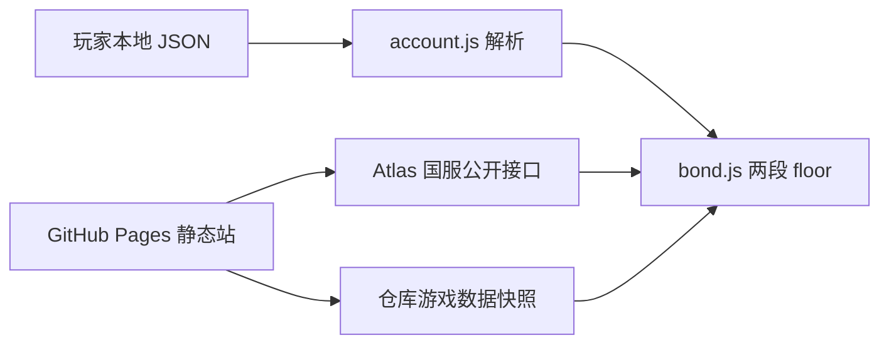

# GitHub 托管与账号配队

Feature Name: github-hosted-roster
Updated: 2026-09-08

## Description

静态单页继续跑在浏览器里。GitHub Pages 发布 `index.html` 与 `src/`。游戏图鉴优先请求 Atlas 国服，失败时读仓库快照。账号配队读取玩家本地选择的 JSON，解析规则对齐 Chaldea 对 `userdata.json` 与登录回包 `userSvt` / `userSvtCollection` 的字段。

## Architecture

GitHub Actions 每天把 Atlas 国服从者与羁绊礼装写成 `src/data/` 快照。页面打开时先请求 Atlas，失败再用快照。账号 JSON 不到 GitHub。

## Components and Interfaces

### `parseAccount(data)`

输入：对象或 JSON 字符串。
输出：`{ ok, error, source, servants[], ces[] }`。

`servants[]`：`{ id, bondLv }`。`ces[]`：`{ id, limitCount, mlb }`。

识别顺序：Chaldea `svtStatus` / `craftEssenceStatus` / `users`；登录回包 `userSvtCollection` + `userSvt`。深度遍历，兼容 `cache.replaced` 与 `response[].success`。

### 游戏数据加载

- `loadServants()`：Atlas `export/CN/basic_servant.json`，失败则 `src/data/servants.json`
- `loadCes()`：Atlas 礼装搜索 `funcType=servantFriendshipUp` 后瘦身，失败则 `src/data/bond-ces.json`
- `scripts/snapshot-game-data.mjs`：给 Actions 写上述两个快照

### UI

顶部增加「自由配队 / 账号配队」和文件选择。账号配队下，非助战槽的搜索源改为持有库存；选中时按库存写入 15 绊与满破。

## Data Models

账号库存只存在 `state.account`。刷新即丢。

登录回包关键字段：`userSvtCollection.svtId`、`friendshipRank`、`status`；`userSvt.svtId`、`limitCount`。`status < 2` 视为未持有。礼装 id 以 `>= 9300000` 识别，再与羁绊礼装图鉴求交。

Chaldea 关键字段：`bondLv`、`svtId`、`limitCount`。

## Correctness Properties

- 两段 floor 公式保持不变
- 账号文件不写入仓库、不发到第三方
- 账号配队的非助战从者搜索集合是持有从者与图鉴的交集
- 助战槽搜索集合是完整图鉴
- `friendshipRank >= 15` 或 `bondLv >= 15` 时选中即勾 15 绊

## Error Handling

- JSON 语法错误：情况栏提示「JSON 无法解析」
- 无从者记录：提示「文件格式无法识别」
- Atlas 失败且无快照：提示「图鉴拉取失败，仍可手填加成」

## Test Strategy

`src/account.test.js` 覆盖：Chaldea 备份抽出 15 绊与满破礼装；登录回包 `cache.replaced` 抽出持有从者并丢掉 `status=1`；礼装 id 与从者 id 分开。

## References

[^1]: (Filename) - 羁绊公式 `.monkeycode/MEMORY.md`
[^2]: (Filename) - 计算器需求 `.monkeycode/specs/2026-09-08-bond-calculator/requirements.md`
[^3]: (Website) - Atlas 国服导出 https://api.atlasacademy.io
