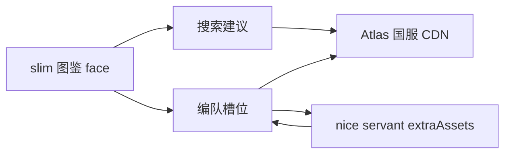

# 槽位从者与礼装图像

Feature Name: slot-art
Updated: 2026-09-08

## Description

编队槽位与搜索建议展示国服从者头像、灵基、灵衣和礼装图。默认用图鉴 Face。选中从者后若 Atlas nice 数据提供多张图，槽位出现切换。切换图像时同步该形态的特质，职阶/灵衣礼装按新特质判断。灵衣外号单独指向该灵衣，不落到默认灵基。图像地址来自 Atlas 国服 CDN；加载失败时用名称占位，计算继续。

## Architecture

页面仍是静态单页。列表与默认图走现有 `face` 字段。选中从者时复用已有的 nice servant 请求，抽出 `extraAssets.faces`。

## Components and Interfaces

### `artsFromNice(svt)`

从 nice servant 抽出 `{ key, kind, label, url, traitIds }[]`。kind 为 `ascension` 或 `costume`。特质来自 `ascensionAdd.individuality`，空则继承基础 traits。无 extraAssets 时回退到 `svt.face`。

### `fetchServantNice(svtId)`

请求 `nice/CN/servant/{id}`。`fetchServantPassives` 改为基于同一响应，避免选中时打两次。

### 槽位字段

`svtArts`、`svtArtKey`、`svtImgOk`、`ceImgOk`。当前从者图 = 所选 art.url，否则 `svt.face`。当前礼装图 = `ce.face`。

### UI

槽位上方 120px 从者头像，右下角叠 48px 礼装图。多于一张从者图时显示「灵基/灵衣」下拉。搜索建议头像 48px。

## Data Models

图像 URL 只存在内存槽位与图鉴对象里，不写入仓库 PNG。

## Correctness Properties

- 切换灵基或灵衣会换成该形态的特质，再重算礼装条件
- 账号导入与计算公式不变
- 图像失败时槽位名称、搜索、计算仍可用

## Error Handling

- nice servant 失败：保留默认 face，隐藏切换
- img error：该位置改为名称
- 快照带 face URL 时继续指向 CDN

## Test Strategy

`artsFromNice` 用假 extraAssets：抽出灵基与灵衣标签；无资源时回退 face。

## References

[^1]: (Filename) - 需求 `.monkeycode/specs/2026-09-08-slot-art/requirements.md`
[^2]: (Website) - Atlas 国服导出 https://api.atlasacademy.io
