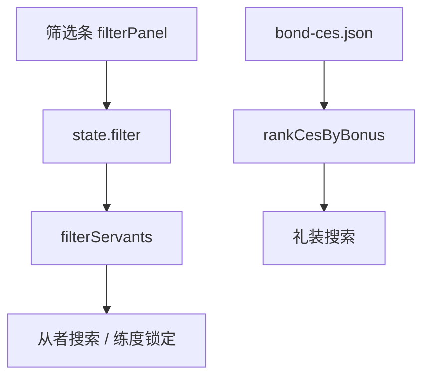

# 从者筛选与可读字体

Feature Name: roster-filter
Updated: 2026-09-09

## Description

在推荐区增加 Chaldea 风格筛选条。职阶 / 星级 / 属性 / 特性每组可切换显示或屏蔽。从者与礼装搜索共用该筛选；礼装按满破羁绊加成降序，从者在同名匹配下按可吃到的最高加成降序。正文改 Noto Sans SC。

## Architecture

## Components and Interfaces

- `src/filter.js`：筛选状态、命中判断、加成排序
- `src/app.js`：筛选条、搜索接入、事件绑定
- `src/style.css` / `index.html`：无衬线字体与行高

## Data Models

每组 `{ options: [], invert: false }`；特性组另有 `matchAll`。Extra 职阶覆盖 ruler 到 shielder。

## Correctness Properties

- 空选项的组不限制结果
- 显示 + 剑阶只留 saber；屏蔽 + 剑阶去掉 saber
- 全中 + 秩序 + 善 只留同时具备 300 与 303 的从者
- 满破 20% 礼装排在午餐 10% 之前

## Error Handling

未知筛选键忽略点击。图鉴未载入时筛选结果为空列表。

## Test Strategy

`src/filter.test.js` 覆盖显示/屏蔽、Extra、星级、属性、特性全中、礼装加成排序。

## References

[^1]: (Filename) - Chaldea FilterGroupData invert / matchAll `/tmp/opencode/chaldea/lib/models/userdata/filter_data.dart`
[^2]: (Filename) - 筛选条 `src/app.js`
