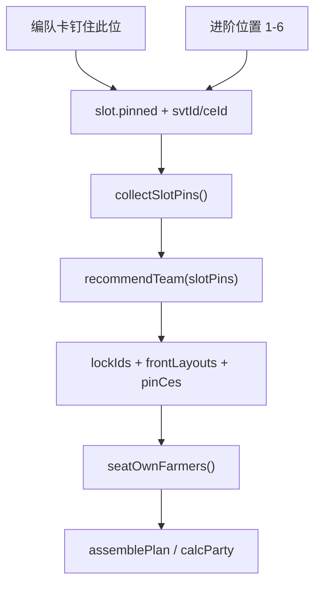

# Pin Team Slots

Feature Name: pin-team-slots
Updated: 2026-09-19

## Description

在现有一键推荐上增加站位钉住。编队卡与进阶 6 位预设共用同一套 `slot.pinned` 状态。推荐把钉住从者固定到指定号槽；该槽已选礼装则并入 `pinCes` / 助战锁定礼装，未选则仍由求解器配礼装。真值仍走 `assemblePlan()` / `calcParty()`。

## Architecture



## Components and Interfaces

- `src/app.js`：卡片勾选「钉住此位」；进阶预设扩到 6 个位置；`runRecommend` 传入 `slotPins`；回填方案时保留 `pinned`
- `src/recommend.js`：`sanitizeSlotPins`、`seatOwnFarmers`、`frontLayouts` 排除后排钉住、`layoutSeatedSlots` 按号槽落座
- `src/user-data.js`：planner 持久化 `slotPins`，并继续读写旧的 `frontIds`

## Data Models

```text
slotPins: [{ position, svtId, ceId, formKey, ceBondId, ceRewardId }]
slot.pinned: boolean
```

`position` 为 1 至 6。留助战位时 6 号只允许礼装。`ceId` 为 0 表示该从者礼装由求解器配置。

## Correctness Properties

- 钉住从者的 `slots[position-1].svtId` 等于钉住的从者 ID
- 钉住且 `ceId>0` 时该从者普通礼装 ID 等于钉住礼装
- 1 至 3 号钉住从者的前排加成为 20%；4 号及之后己方槽为后排
- 比较键与公式与现网一致：`assemblePlan` / `calcParty` 两段 floor

## Error Handling

- 同一从者钉在两个站位：提示「站位钉住不能重复从者」
- 钉住人数超过己方槽上限：提示「锁定超出编队上限」
- 账号库存没有该从者或礼装：提示「该锁定无法满足」

## Test Strategy

- `recommend.test.js`：钉后排 5 号位；钉 1 号位且带午餐；钉从者不带礼装时仍能配礼装
- `user-data.test.js`：planner 读写 `slotPins`
- 现有 `frontIds` 与 `pinCes` 用例继续通过

## References

[^1]: (Filename) - 需求 `.monkeycode/specs/2026-09-19-pin-team-slots/requirements.md`
[^2]: (Filename) - 求解 `src/recommend.js`
